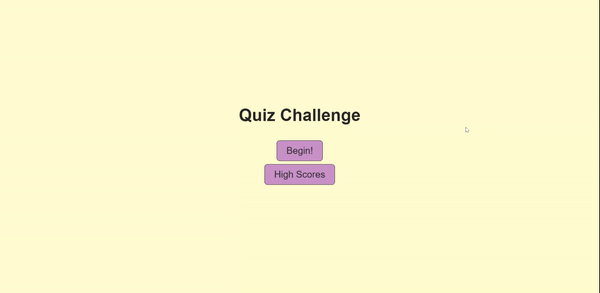

# Quiz Challenge

## Description

I made a website that asks the user a series of questions and gives them a score based on how many seconds were remaining.

## Usage

The user will begin by pressing the purple "Begin!" button. They will the proceed to answer the provided questions within the 60 second timer, losing 2 seconds for an incorrect answer. The user will then be given the option to save their high score to local storage, which will be displayed on the 'High Scores' screen, play again, go home, or show high scores.

Link to the website: https://amartrain1.github.io/Quiz/

## Credits
James Q Quick - Quiz App Tutorial
https://www.youtube.com/playlist?list=PLDlWc9AfQBfZIkdVaOQXi1tizJeNJipEx